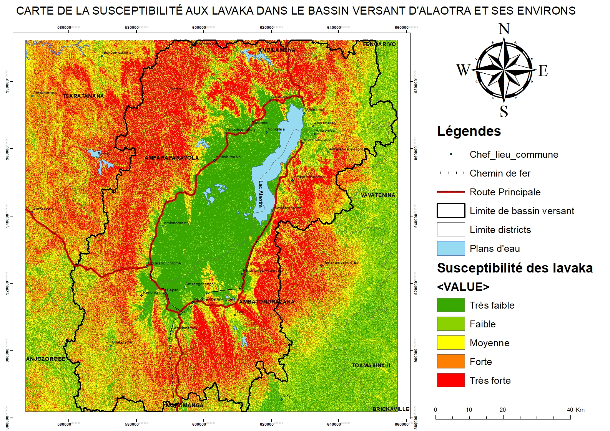

# 🌍 Prédiction de la Susceptibilité aux Lavaka par Deep Learning
**Étude de l'érosion des sols dans le Bassin Versant de l'Alaotra, Madagascar**

## 🗺️ Cartographie Résultante
Voici le produit final de la modélisation : une carte de susceptibilité à haute résolution permettant d'identifier les zones critiques.

*Les cartes générées localisent les zones prioritaires pour la lutte contre l'érosion. Livrables disponibles dans le dossier [Cartes/](./Cartes).*

---

## 📊 Performance du Modèle ANN
Le réseau de neurones artificiels (ANN) a été entraîné sur un inventaire de **1 400 points** avec une fusion de données multi-sources. 

* **Précision Globale (Accuracy) :** 81.26 %
* **AUC (Area Under Curve) :** 0.8853
* **Données d'entrée :** Sentinel-2 (NDVI), SRTM (Pente, Rugosité, Exposition), WorldClim (Précipitations).

*Vous pouvez retrouver l'ensemble des analyses dans le dossier [Courbes/](./Courbes).*

## 📂 Structure du Projet
* `Code.ipynb` : Script complet de prétraitement et d'entraînement (PyTorch).
* `/Courbes` : Visualisations des performances (ROC, Matrice de Confusion).
* `/Cartes` : Cartographie finale et couches SIG.
