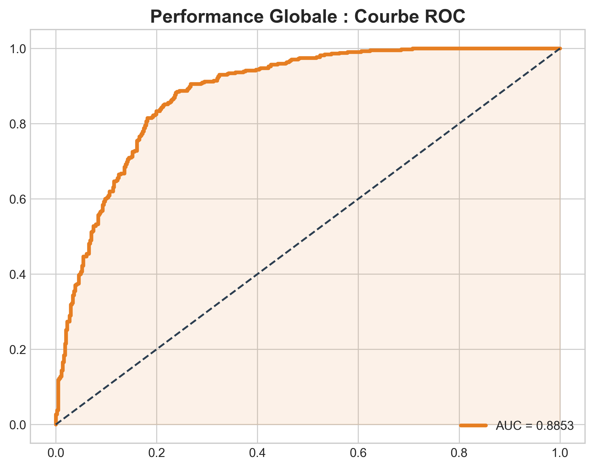

# 🌍 Prédiction de la Susceptibilité aux Lavaka par Deep Learning
**Étude de l'érosion des sols dans le Bassin Versant de l'Alaotra, Madagascar**

## 📊 Résultats de l'Étude

### Courbes de Performance
Les résultats montrent une excellente capacité de discrimination (**AUC = 0.88**). 
Vous pouvez retrouver l'ensemble des analyses dans le dossier [Courbes/](./Courbes).

### Cartographie Prédictive
Les cartes générées localisent les zones prioritaires pour la lutte contre l'érosion.
Livrables disponibles dans le dossier [Carte Predictif de Lavaka/](./Carte Predictif de Lavaka).
> *Visualisation directe :*

## 📂 Structure du Projet
* `Code.ipynb` : Script complet de prétraitement et d'entraînement (PyTorch).
* `/Courbes` : Visualisations des performances (ROC, Matrice de Confusion).
* `/Cartes` : Cartographie finale et couches SIG.VI), SRTM (Pente, Rugosité, Exposition), WorldClim (Précipitations).

## 📂 Structure du Projet
* `Code.ipynb` : Script complet de prétraitement et d'entraînement (PyTorch).
* `/Courbes` : Visualisations des performances (ROC, Matrice de Confusion).
* `/Cartes` : Cartographie finale et couches SIG.
